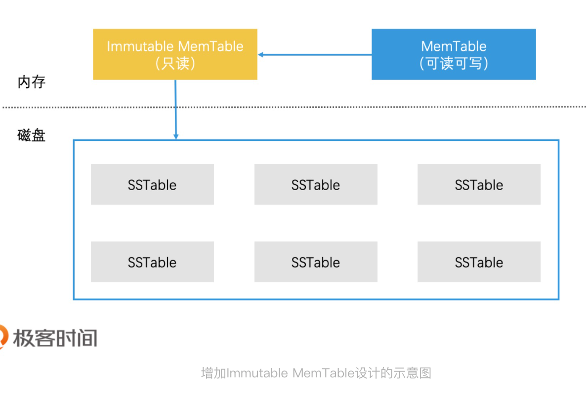

# 存储系统：从检索技术角度

LevelDB是由Google开源的存储系统的代表，在工业界中被广泛的使用。它的性能十分突出，那如何做到的？

leveldb是基于LSM树优化而来的存储系统。都做了哪些优化呢？我们知道LSM树会将索引分为内存和磁盘两部分，并在内存达到阈值时启动树合并。但是，这里面存在大量细节问题。比如说，数据在内存中如何高效检索？数据是如何高效地从内存转移到磁盘的？以及我们如何在磁盘中对数据进行组织管理？还有数据是如何从磁盘中高效地检索出来？

其实，这些问题也是工业中常遇到的实现问题，现在看看怎么来优化检索索引的，增高效率。

## 如何利用读写分离设计将内存数据高效存到磁盘

首先，对内存中索引的高效检索，我们可以用很多检索技术，如红黑树、跳表等，这些数据结构会比**B+树更高效**。因此，LevelDB对于LSM树的第一个改进，就是使用**跳表**代替**B+树**来实现内存中C0树。

接下来，怎么解决**内存数据要如何高效存储到磁盘**。我们将内存中的C0树和磁盘上的C1树归并来存储的。但内存数据一边被写入修改，一遍被写入磁盘，我们在归并的时候就会遇到数据一致性管理问题。一般来说，这种情况是需要进行”加锁“处理的，但是加锁会大幅度降低性能。

为此，LevelDB做了读写分离设计。它将内存中的数据分为了两块，一块叫做**MemTable**，它是可读可写的。另一块叫做**Immutable MemTable**，它是只读的。这两款数据的数据结构完全一样的，都是跳表。那他们怎么应用的？

具体来说，当MemTable的存储数据达到上限时，我们直接接它切换为只读的ImmuTable写入磁盘的问题。而且，由于Immtable MemTable是只读的，因此，它不需要加锁就可以高效地写入磁盘中。

好了，数据的一致性管理问题解决了，我们接着看C0树和C1树的归并。在原始LSM树的设计中，内存索引写入磁盘时是直接和磁盘中的C1树进行归并的。但如果工程中也是这么实现的话，会有两个很严重的问题：

1. 合并代价很高，因为C1树很大，而C0树很小，这会导致它们在合并时产生大量的磁盘io；
2. 合并频率会很频繁，由于C0树很小，很容易被写满，因此系统会频繁进行C0树和C1树合并，这样频繁合并会带来大量磁盘IO，这更是系统无法承受的。

针对这两个问题，LevelDB采用了延迟合并的设计来优化。具体来说就是，先将Immtable MemTable顺序快速写入到磁盘，直接编程一个个SSTable（Sorted String Table）文件，之后再对这些SSTable文件进行合并。这样就避免了C0树和C1树昂贵的合并代价。至于SSTable文件进行合并。这样就避免了C0树和C1树昂贵的合并代价。至于SSTable文件是什么，以及多个SSTable文件怎么合并，我们一会儿在详细分析。

好了，现在以及指导了，内存数据高效存储到磁盘上的具体方按了，那么数据如何检索呢？
在检索一个数据的时候，我们会现在MemTable中茶找，如果查找不到再去Immutable Memtable中查找。如果Immuable MemTable也查找不到，我们才会到磁盘中去查找。

因为磁盘中原有的C1树被多个娇小的SSTable文件代替了。那现在我们要解决的问题就变成了，如何快速提高磁盘中多个SSTable文件的检索效率。

## SSTable的分层管理设计

我们知道，SSTable文件是由
