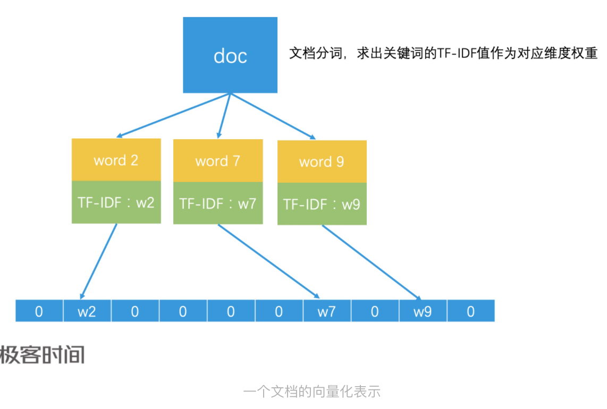
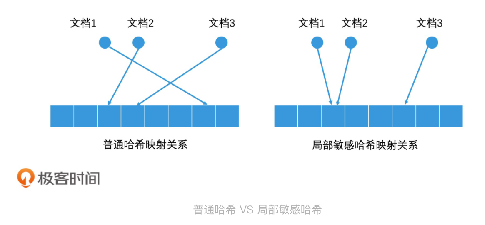
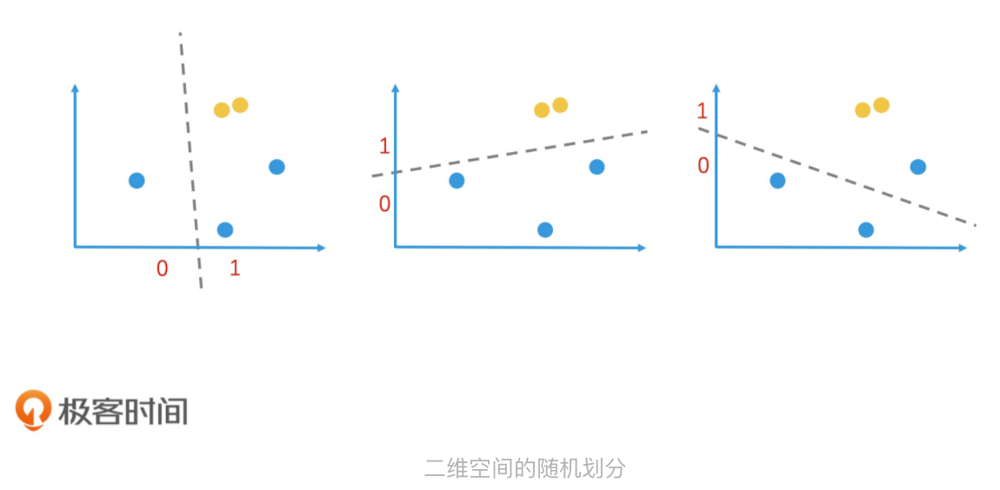
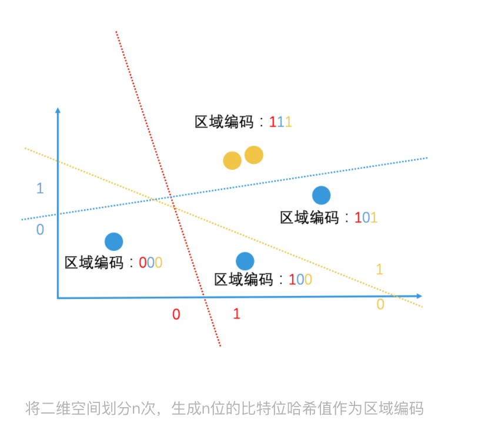

# 最近邻检索

 *如何用局部敏感哈希快速过滤相似文章* 

在搜索引擎和推荐引擎中，往往有很多文章内容都是非常相似的，他们可能只有一些修饰词不同。如果在搜索结果和推荐结果中，我们将这些文章不加过滤就全部展现处理啊，那用户可能在第一页看到的都是几乎相同的内容。这样的话，用户的使用体验就会非常糟糕。因此，在搜索引擎和推荐引擎中，对相似文章去重是一个非常重要的环节。

## 如何在向量空间中进行近邻检索？

一篇文章是如何用计算机能理解的形式表示出来的，以及怎么计算两篇文章的相似性。最常见的方式就是使用**向量空间模型**。所谓向量空间模型，就是将所有文档中出现过得所有关键词都提取处理。如果一共有n个关键词，那每个关键词就是一个维度，这就组成了一个n维的向量空间。

那一篇文档具体如何表示呢？我们可以假设，一篇文章中有k（0<k<=n）个关键词，如果第k个关键词在这个文档中的权重是w，那这个文档在第k维上的值就是w。一般来说，我们会以一个关键词在这篇文档中的TF—IDF值作为w的值。而如果文章不包括第k个关键词，那它在第k维上的值就是0，那我们也可认为这个维度的权重就是0。这样，我们就可以用一个n维的向量来标识一个文档，也就是<w1,w2,w3……wn>。这样依赖，每一个问的那个就是n维向量空间中的一个点。

那接下来，计算两篇文章相似度就变成了计算两个向量的相似度。计算向量相似度实际上就是计算两个向量的距离，距离越小，他们就越相似。具体在计算的时候，我们可以使用很多距离度量方式。比如余弦距离，欧式距离等。一般采用余弦距离来计算。

拓展到搜索引擎和推荐引擎中，因为每个文档都是n维向量中的一个点，所以查询相似文章的问题，就变成了在n维空间中，查询离一个点巨鹿最近的k个问题。如果把这些点想象成人，这就喝我们在二维空间中查询附近的人问题非常相似。

首先，在十几维度级的低维空间中，我们可以使用k-d树进行k维空间的近邻检索，它的性能还不错。但随着维度的增加，我们还要精准找到最邻近的k个点，k-d需要不停的递归来探索临接区域，检索效率就会急剧下降，甚至接近于遍历代价。当关键词时几万甚至几百万级别时，文档的向量空间可能是一个上万维甚至是是百万维的超高维空间，使用k-d树就更难以完成检索工作了。因此，我们需要寻找更简单、高效的方案。

这个时候，使用非精准Top K检索代替精准Top K检索方案就又可以派上用场了。这是为什么呢？因为高维空间本身就很抽象，在用向量空间中的一个点表示一个对象的过程中，如果我们我们选择了不同的权重计算方式，那得到的向量就会不同，所以这种不碍事方法本身就损失了一定的精确性。

因此，对于高维空间的近邻检索问题，我们可以使用**近邻最近检索**来实现。你可以先想想查询附近的人是怎么实现的，然后再想想怎么处理高维空间。

### 局部敏感哈希

借助非精准检索的思路，我们可以将高维空间的点也进行区域划分，然后为每个区域生成一个简单的一堆编码。这样，当我们要查找一个点最邻近的k个点的时候，直接计算出区域编码就能高效检索出同一个区域的所有对象了。

也因此，我们就能得出一个结论，那就是同一个区域的不同点，通过统一的计算过程，都能得到相同的区域编码。这种将复杂对象映射成简单编码的过程，是不是很像哈希的思路？

所以，我们可以利用哈希的思路，将高维空间中的点映射成低维空间中的一堆编码。换句话说，我们通过计算不同文章的哈希值，就能得到一维哈希编码。如果两篇文章内容100%相同，那他们的哈希值就是相同的，也就相当于编码相同。

不过，我们可以利用哈希的思路，将高维空间中点映射成低维空间中的一维编码。换句话说，我们通过计算不同文章的哈希值，就能得到一维哈希编码。如果两篇文章内容100%相同，那它们的哈希值就是相同的，也就相当于编码相同。

不过，如果我们用的是普通的哈希函数，只要文档中的关键词有一些轻微编号，哈希值就会有很大的差异。但我们希望整体相似度高的两篇文章，通过哈希计算以后得到值也是相近的。因此，工业界设计了一种哈希函数，它可以让相似的数据通过哈希计算以后，生成的哈希值是相近的。这种哈希函数就叫做**局部敏感哈希**

其实局部敏感哈希并不神秘。让我们以熟悉的二维空间为例来进一步解释。

在二维空间中，我们随意划一条直线就能将它一分为2，我们就把直线上方的点哈希值定位1，把直线下方的点的哈希值定位0.这样就完成一个简单的哈希映射。通过这样的随机划分，两个很接近的点被同时划入到同一边的概率，就会远大于其他节点。也就是说，这两个节点的哈希值相同的概率远大于其他节点。

当然，这样的划分有很大的随机性，不一定可靠。但是，如果我们连续做了n次这样的随机划分，这两个点每次都在同一边，那我们就可以认为他们很大概率上是相近的。因此，我们只要在n次随机划分的过程中，记录下每个点在每次划分后的值是0还是1，就能得到一个n位包含0和1的序列了，这个序列就是我们得到哈希值，也就是区域编码。

因此，对于高维空间，我们构造局部敏感哈希函数的方案是，随机的生成n个超平面，每个超平面都将高维空间划分为两部分。位于超平面上面的点的哈希值为1，位于超平面下面的点的哈希值为0.由于有n个超平面，因此一个点会被判断n次，生成一个n位的包含0和1的序列，它就是这个点的哈希值。这就是一个基于超平面划分的局部敏感哈希构造方法。

如果有两个点的哈希值完全一样的，就说明他们被n个超平面都划分到了同一边，它们有很大的概率是相近的。即使哈希值不完全一样，只要他们在n个比特位中有大部分是相同的，也能说明他们有很高的相近概率。

上面我们说的判断标准都比较笼统，实际上，在利用局部敏感哈希值来判断文章相似性的时候，我们会以表示比特位差异数的**海明距离**为标准。我们可以认为如果两个对象的哈希值的海明距离低于k，他们就是相近的。举个例子，如果有两个哈希值，比特位分别为0000和10000。你可以看到，它们只有第一个比特位不一样，那他们海明距离就是1.我们认为海明距离在2以内的哈希值都是相似，那他们就是相似的。

。。。。。。。

==看不下去了，后面不理解了，有兴趣的去极客看看相关教程==

