# 空间检索

## 如何使用Geohash实现“查找附近的人”

如何开发一个附近的人？怎么做？

把所有人的坐标取出来，计算每个人和自己当前坐标的距离。然后排序并在地图上列出来。但是仔细想想就会发现，这种方案在大规模的系统中并不可行。

因为，系统中人数达到了一定的量级，那计算和所有人的距离在排序，这会是一个非常大的代价。尽管我们可以使用堆排序代替全排序来降低代价，但取出所有人的位置信息并计算距离，这本身就是一个很大的开销。

### 使用非精准检索的思路实现“查找附近的人”

事实上，“查找附近的人”和“检索相关的网页”这两个功能的本质是非常相似的。在这两个功能的实现中，我们都没有明确的检索目标，也就都不需要非常精准的检索结果，只需要保证质量足够高的结果包含在Top K个结果中就够了。所以，非精准Top K检索页可以作为优化方案，来实现“查找附近的人”功能。

我们可以通过限定附近的范围来减少检索空间。一般来说，同一个城市的人往往会比不同城市的人距离更近。所以我们不需要去查询所有的人，只需要取查询自己所在城市的人，然后计算出自己和他们的距离就可以了，这样就可以大大缩小检索范围了。那在同一个城市中，我们也可以优先检索同一个区的用户，来再次缩小检索范围。这就是非精准检索思路。

在这种限定“附近”区域的检索方案中，为了进一步提高检索效率，我们可以将所有的检索空间划分为多个区域并做好编号，然后以区域编号为key做好索引。这样，当我们需要查询附近的人时，先快速查询到自己所属区域，然后再将该区域的所有人位置取出，计算和每一个人的距离就可以了。在这个过程中，划分检索空间以及对其编号是最关键的异步，那具体怎么操作呢？

#### 如何对区域进行划分和编号？

对于一个完整的二维空间，我们可以用二分的思想将其均匀划分。也就是在水平和垂直方向一分为2，这样一个空间就会被均匀的划分为四个子空间，这四个子空间，我们可以用两个比特位来编号。在水平方向上，我们用0来标识坐标的区域，用1来标识右边的区域；在垂直方向上，我们用0来标识下面的区域，1表示上面的区域。同时这一个格子还可以再次划分四个子空间。

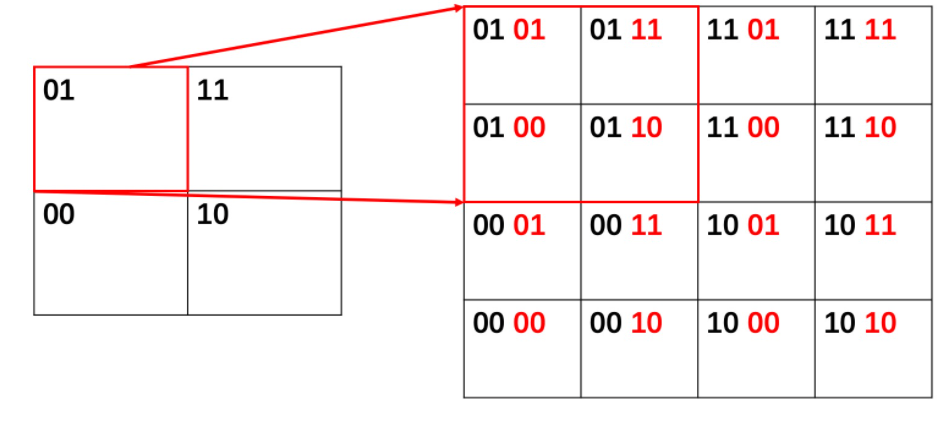

这种区域编号有两个优点：

1. 区域有层次关系：如何两个区域的前缀相同，说明他们属于同一个大区域
2. 区域编码带有分割意义：奇数位的编号代表了垂直切分，偶数位的编号代码了水平切分，这会方便区域编码的计算。

#### 如何快速查询同一个区域的人？

那有了这样的区域编号后，我们该怎么查询？这就要说道区域编码的特点：**区域编码能将二维空间的两个维度用一位编码表示**。利用这个特点，我们就可以使用一维空间中常见的检索技术快速查找了。我们将区域编码作为key，用有序数组存储，这样就可以用二分查找进行检索了。

如果有效区域动态增加，我们还可以使用二叉检索树，跳表等检索技术来索引。在一些系统的实现中，比如redis，它就可以直接支持类似的地理位置编码的存入和检索，内部实现的方式是，使用跳表按照区域编码进行排序和查找。此外，如果希望检索效率更高，我们还可以使用哈希表来实现区域的查询。

这样一来，当我们想要查询附近的人时，只需要根据自己的坐标，计算出自己所属区域的编码，然后再索引中查询出所有属于该区域的用户，计算这些用户和自己的距离，最后排序展现即可。

不过，这种非精准的方案，会带来一定的误差。也就是所，我们找到的所谓附近的人，其实只是和你在同一区域而已，并一定离你最近的，假如你的位置正好处于区域边缘，那离你最近的人，也可能在你的临街区域里。

好在，在“查找附近的人”这类目的性不明确的应用中，这样的误差我们也是可以接受的。但是，在另一些有精准查询需求的应用中，是不允许存在这类误差的。比如说，在游戏场景中，角色技能的攻击范围必须是精准的，它要求技能覆盖范围内的所有敌人都应该受到伤害，不能有遗漏。那这是怎么做到的呢？你可以先想一想，然后再来看我的分析。

#### 如何精准查询附近的人？

既然临接区域的人距离我们更近，那我们是不是可以建立一个更大的候选集合，把这些临接区域的用户都加进去，再一起计算记录和排序，这样问题是不是就解决了呢？

对于目标所在的当前区域，我们可以根据期望的查询半径，以当前区域为中心向周围扩散，从而将周围的区域都包含进来。假设，查询半径正好是一个区域变长的一半，那我们只要将目标周围一圈，也就是8个临接区域中的用户都加入候选集，这肯定就不会有遗漏了。这时，虽然计算量提高了8倍，但我们可以给出精准的解了。

如果要降低计算量，我们可以将区域划分的粒度提高一个量级。这样，区域划分就更精准，在查询半径不变的情况下，需要检索的用户的数量就会更少。

知道了要查询的区域有哪些，那我们怎么快速寻找这些区域的编码呢？这就要回到我们区域编码的方案本身了。前面我们说了，区域编码可以根据奇偶位拆成水平编码和垂直编码这两块，如果一个区域编码是0110，那它水平编码就是01，垂直编码就是10。那该区域右边一个区域的水平编码的值就比自己大1，垂直编码则相同。因此，**我们通过分解出当前区域的水平编码和垂直编码，对对应的编码值进行+1或者-1操作，就能得到不同方向上临接的8个区域的编码了。**

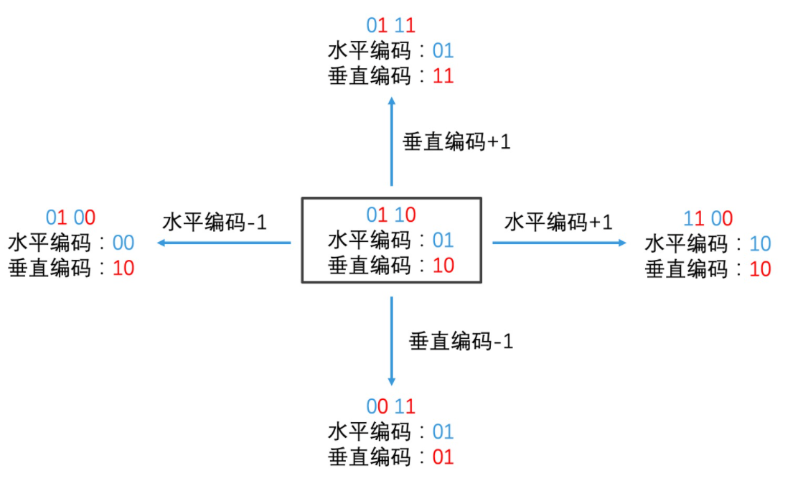

以上就是精准查询附近人的检索过程，我们可以总结为2步：

1. 先查询出自己所属的区域编码，再计算出周围8个临接区域的编码
2. 在索引中查询9次，取出所有属于这些区域中的人，精准计算出每一个人和自己的距离，最后排序输出结果。

#### 什么是GeoHash编码

用户对应的实际的地理位置坐标，那它和二维空间的区域编码又是怎么联系的？

如果将地球看作是一个大的二维空间，那经纬度就是水平和垂直的两个切分方向。在给出一个用户的经纬度坐标后，我们就能通过对地球经纬度区间的不断二分，就能得到这个用户所属的用户编码了。

地球的纬度区间是[-90,90],精度是[-180，180]。如果给到一个用户经纬度为（39.983429, 116.48661），那我们求这个用户编码过程就是：

1. 纬度：第一次二分，39是在[0,90]之间，那么属于空间上半边，因此得到编码1。然后在[0,90]空间上再次二分，在[0,45]之间，属于下半边，得到0。两次划分得到编码就是10
2. 经度：同理可得11
3. 我们把经度和纬度编码交叉起来，先经度，再纬度就是1110

如果区域划分的粒度很细，我们就要持续，多次二分，每多分一次就需要增加一个bit位来标识编码。如果经度和纬度各分15次，那就需要一个30bit来标识一个位置

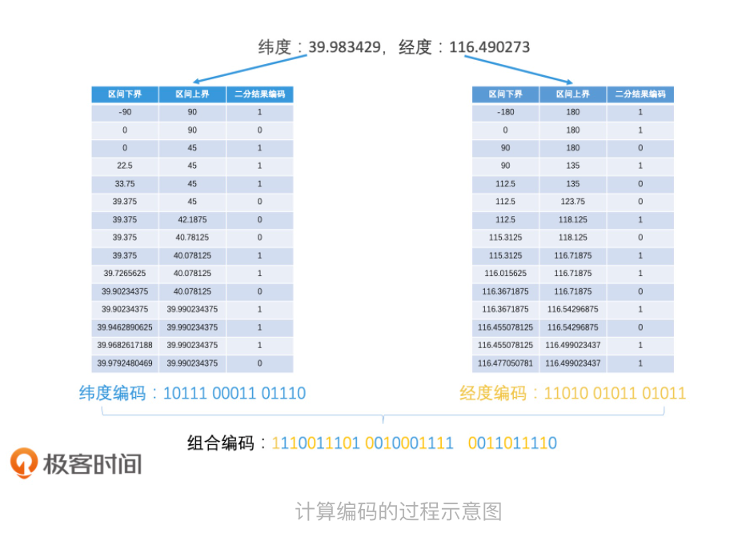

这样得到编码就会特别长，那为了简化编码标识，我们可以以5个比特位为一个单位，吧长编码转为base32，最终得到就是wx4g6y。这样30个比特位，只需要6个字符就可以标识了。

这样做不仅存储简单，而且具有相同前缀的区域属于同一个大区域，看起来也非常直观。**这种将经纬度坐标转化字符串编码的方式就叫做GeoHash编码。**大多数应用都会使用Geohash编码进行地理位置表示，以及在很多系统中，比如redis，mysql以及es中，也都支持geohash的存储和表示

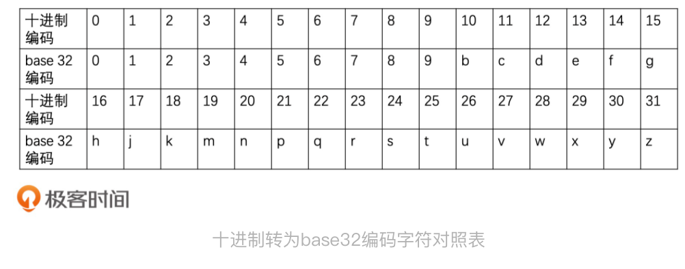

在实际转换过程中，由于不同长度的geohash代表不同大小的覆盖区域，因此我们可以结果geohash字符长度和覆盖区域对照表，根据自己的应用选择合适的geohash长度。

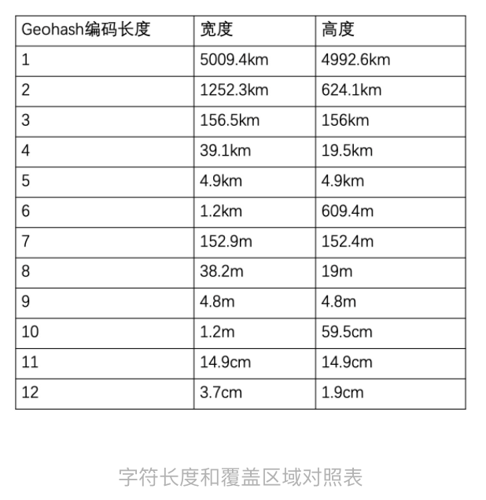

不过Geohash也有缺点，由于geohash编码就一个字符串表示5位，因此每当字符长度变化一个单位，区域的覆盖度变化就是32倍，这会导致区域 范围花费不够精细。

因此，当发现粒度不符合需求时，可以将geohash编码转化为二进制编码。这样长度变为单位就是1个bit位了，区域覆盖度变化就是2倍，我们就可以灵活调整自己期望的区域覆盖度。实际上，许多系统底层视线中，在内存中的存储和计算都是以二进制方式进行的。

## 查找最近的加油站

在一些基于地理位置的服务中，我们并不关心检索结果是否就在我们附近，而是必须找到“最近”的一批满足我们要求的结果。

加入在长途自驾中，需要地图找加油站，这些加油站可能离我们很远，不算“附近”，但地图又必须要返回最近的k个结果。还有比如附近的医院，公共厕所等等。

对于这种需要动态调整范围的查询场景，如何处理？

### 直接进行多次查询

假设我们当前地址的geohash编码为wx4g6yc8，那我们就可以先用wx4g6yc8去查询当前区域的加油站。如果结果为空，就扩大范围。扩大范围思路有两种：

1. 一圈一圈扩大查询范围，第一次查询周边8个临接区域，，如果空则继续扩大，查询外圈16个，知道满足条件。这种方案的查询次数会成倍增加，效率也不高。

   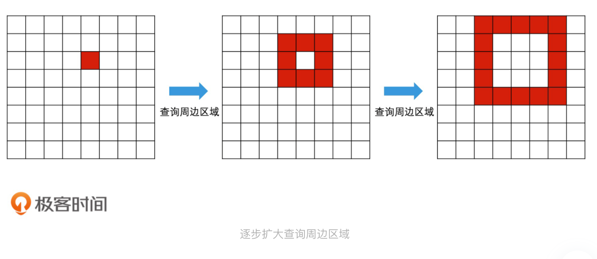

2. 提高查询单位。比如说，直接将geohash编码去掉最后一位，用wx4g6yc8去查询，结果不满足条件就把最后一位去掉，使用wx4g6yc去查询，再不满足就用wx4g6y查询，直到满足条件。

   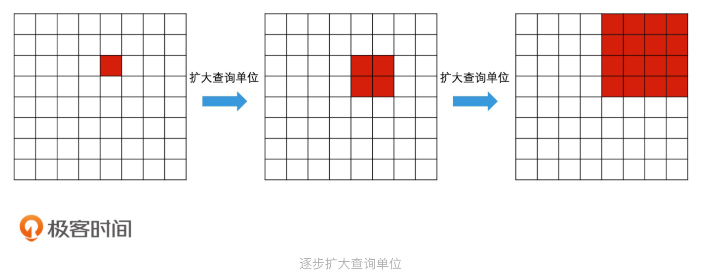

两者比较，第二种思路中，每次查询的区域单位都得到了大范围提升，因此，查询次数不会太多。比如所，对于一个长度为8的Geohash编码，我们最多只需要查询八次。

这个检索方案虽然用很少的次数就能“查询最近的k个结果”，但我们还需要保证，每次查询请求都能快速返回结果。这就要求我们采用合适的索引技术，来处理geohash的每个层级。

比如说，如果使用基于哈希表的倒排检索来实现，我们就需要在GeoHash每个粒度层级上都分别建立一个单独的倒排表。这就意味着，每个层级的倒排表中都会出现全部的加油站，数据会被复制多次，这会带来非常大的存储开销。我们是否有优化存储的方案呢？

我们可以利用geohash编码一堆可排序的特点，使用数组或者二叉检索树来存储和检索。由于数组和二叉检索树都可以支持范围查询，我们只需要简历一份粒度最细的索引就可以了。这样，当我们要检索更大范围的区域时，可以直接将远啦IDE查询改写为范围查。具体怎么做呢？

我来举个例子。在检索完 wx4g6yc8 这个区域编码以后，如果结果数量不够，还要检索 wx4g6yc 这个更大范围的区域编码，我们只要将查询改写为“查找区域编码在 wx4g6yc0 至 wx4g6ycz 之间的元素”，就可以利用同一个索引，来完成更高一个层级的区域查询了。同理，如果结果数量依然不够，那下一步我们就查询“区域编码在 wx4g6y00 至 wx4g6yzz 之间的元素”，依此类推。

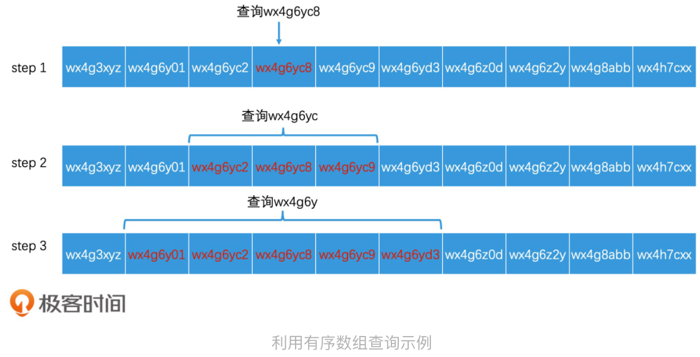

但是，这种方案有一个缺点，那就是在每次调整范围查询时，我们都要从头开始进行二分查找，不能充分利用上一次已经查询到的位置信息，这会带来无谓的重复检索的开销。那该如何优化呢？你可以先想一想，然后我们一起来看解决方案。

### 四叉树动态调整查询范围

许多系统对geohash底层实现，其实都是使用二进制进行存储和计算的。而二进制区域编码的生成过程，就是一个逐渐二分空间的过程，经理二分后的区域之间是有层次关系的。如果我们把这个过程滑下来，它就很像我们之前讲过的树形结构。

因此我们可以尝试用树形结构来进行索引。这里，我们就要引入一个新的数据结构四叉树。

四叉树的根节点代表了整个空间，每个节点的四个分叉分别代表了四个子空间。其中，树根和中间节点不存数据，只记录分叉指针。而数据只记录在最小的区域，就是叶子节点上。

如果我们从根节点开始，不停的四分下去，知道每个分支的叶子节点都是最小粒度区域。那样构建出来的四叉树，每个节点都有四个子节点，就叫做**满四叉树**

对于满四叉树的每个节点，我们可以编号。换句话说，我们可以按00，01，10，11的编号来区分满四叉树的四个子节点。这样一来，只要我们从根节点遍历到叶子节点，然后将路径上每个节点的编号连起来，那最后得到的编码就是这个额叶子节点所代表的的区域编码。

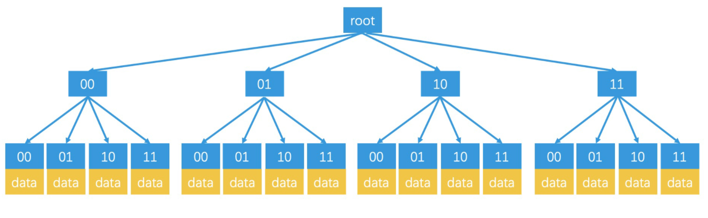

现在知道了四叉树的结构和特点了，那我们怎么利用它完成自动调整的范围的Top K检索呢？

假设一个人所属最小区域的编码是0110，那我们在检索的时候，就以0110为key，沿着四叉树的对应分支去寻找相应的区域，查询路径为01-10.如果查找到了叶子节点，并且返回的结果大于k个，就可以直接结束检索。如果返回结果不足k个，我们就可以得递归返回到上一层的父节点，然后以这整个父节点的区域编码为目标进行检索。这样，我们就避免了要再次从树根检索到父节点的开销，从而提升了检索效率。

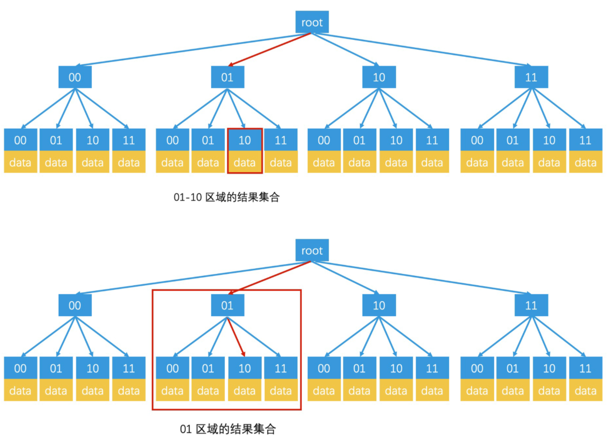

### 如何利用非满四叉树优化存储空间

尽管我们以最小区域单位为叶子节点的满四叉树，能够很好的提升检索效率，但是在数据稀疏的时候，许多叶子节点中的数据可能是空的，这就很有可能造成大量的空间浪费。为了避免出现空间浪费，我们可以使用动态节点分裂的非满四叉树。

首先，我们可以给每个叶子节点规定一个容量上限。比如说，我们可以将上限设置为n，那么，一开始的四叉树只有一个根节点，这个根节点同时也是叶子节点，它表明了当前的全部空间范围。当有数据加入的时候，我们直接记录在这个节点中，查询时也只查询这个节点即可。当插入的数据小于n的时候，我们不需要进行任何肤质的查询操作，只需要将根节点的所有数据读出来，然后进行举例计算并排序即可。

随着加入的数据越来越多，如果一个叶子节点的容量超出了容量的上线，我们就将该节点进行分裂。首先，我们将该节点转为中间节点，然后，我们会为这个节点生成1至4个叶子节点（注意：不一定要生成4个叶子节点），并将原来存在这个节点上的数据都转移到对应的叶子节点中，这样就完成了分裂。

不过，有一种极端的情况是，这些数据都会转入到同一个下层叶子节点上。这时，我们就需要继续分裂这个叶子节点，知道每个叶子节点的容量在阈值下为止。

通过这种动态生成的叶节点的方案，我们就能得到一颗非满四叉树。和满四叉树比较它的叶子节点会更少，而且每个叶子节点标识的区域范围也可能是不一样的。这使得非满四叉树具有更好的空间利用率。非满四叉树的查询过程和满四叉树十分相似，也是根据当前的区域编码，找到对应的叶子节点，并根据叶子节点上存储的数据数量，判断是否要递归扩大范围。

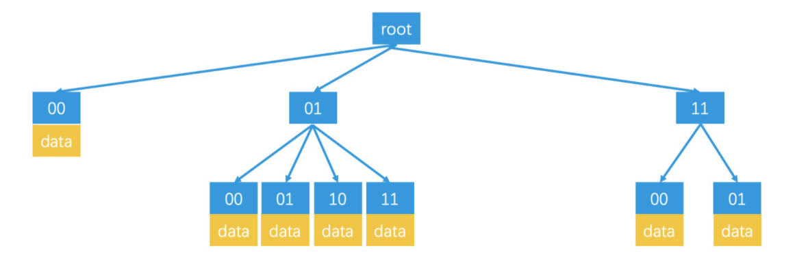

### 如何使用前缀树优化GeoHash编码的索引？

上面，我们都是用二进制编码来说明的，你可能会问，我们使用了GeoHash编码方式，是否也可以使用类似的检索技术来索引呢？

实际上，对于字符串检索，有一种专门的数据结构，叫做前缀树（Tire树）。

前缀树的思路和四叉树非常相似，它也是一种逐层划分检索空间的数据结构。它的根节点代表了整个检索空间，然后每个中间节点和叶子节点都只存储一个字符，代表一个分支。这样，从根节点到叶子节点的路劲连起来，就是一个完整的字符串。因此，当使用Geohash编码来标识区域时，我们可以建立一个前缀树来进行索引，前缀树的每个节点最多会有32个子节点。

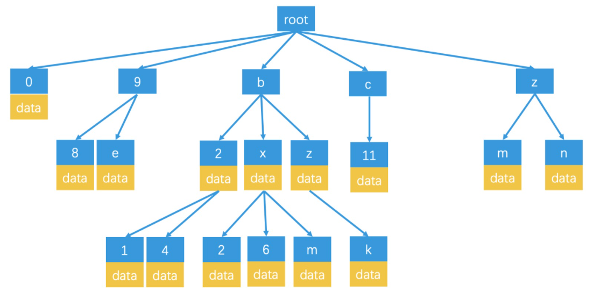

如何利用前缀树来检索呢？当我们查询wx4g6yc8这个区域时，我们会沿着w-x-4-g-6-y-c-8的路劲，检索到对应的叶子节点上，然后取出这个叶子节点上存储的数据。如果这个区域的数据不足k个，就返回父节点上，检索对应的区域，知道返回结果达到k个为止。由于整体思路和四叉树十分相似，就不展开细说了。

此外，前缀树除了用在GeoHash编码的检索上，也经常用于字典的检索，因此也叫字典树。字典树适用于匹配字符串的检索场合。

总结来说，利用树形结构来划分空间提高检索效率的方案，它的应用非常广泛。对于更高维度空间的最近邻检索，我们也可以使用类似的检索方案来花费空间，比如说，在三维空间中，八叉树就是常见的检索方案。那拓展到更高的维度，如k维，我们还可以使用k-d树来检索。

k-d树一种是更通用的，对任意维度都可以使用的检索方案。k-d树四叉树，八叉树的检索思路并不相同，它在花费子空间的时候，并不是直接将空间划分为2^k个子空间，而是会选出一个最优区分度的一个维度，将该维度的空间进行二分，然后对划分的子空间再进行同样的二分处理，所以，它实际上是一个二叉树。而且，由于它的分支数和维度k的具体值无关，因此具有更好的通用性。

事实上，k-d树在维度规模不大的场景下，确实具有不错的检索效率。但是，在成百上千的超高维度的场景中，k-d树的性能会急剧下降。那在高维空间中，我们又该如何快速地查找到最近的k个对象呢？这也是搜索引擎和推荐引擎在很多应用场景中都要解决的问题。

