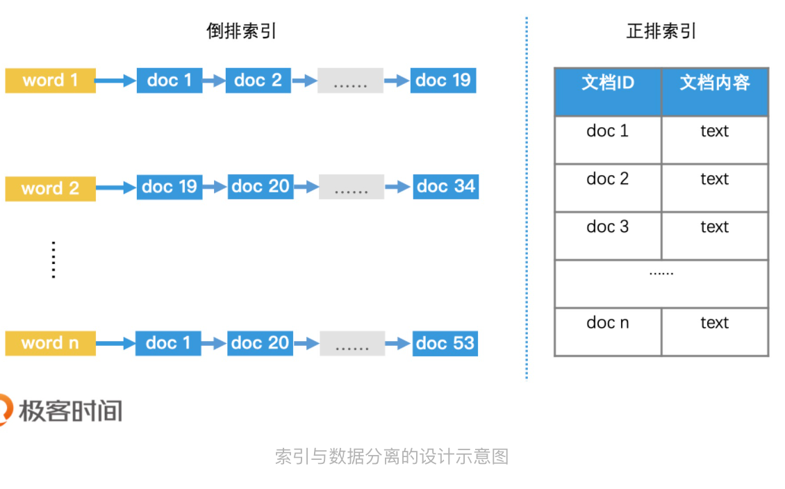
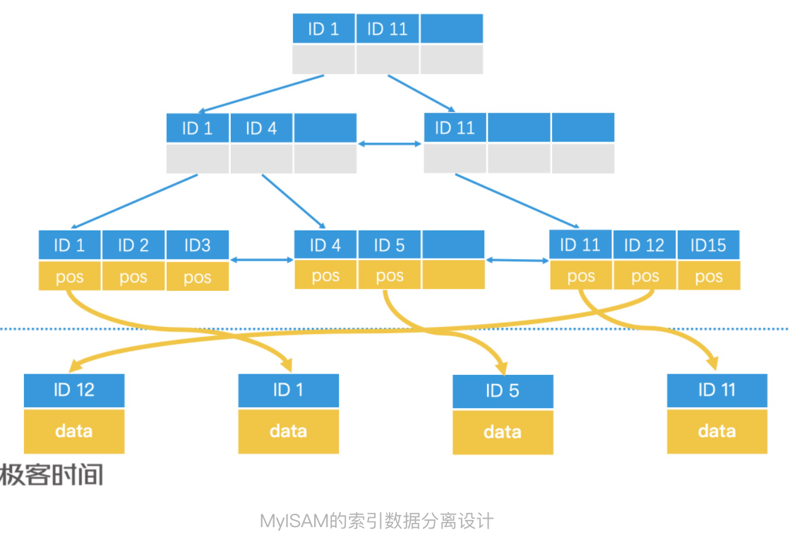
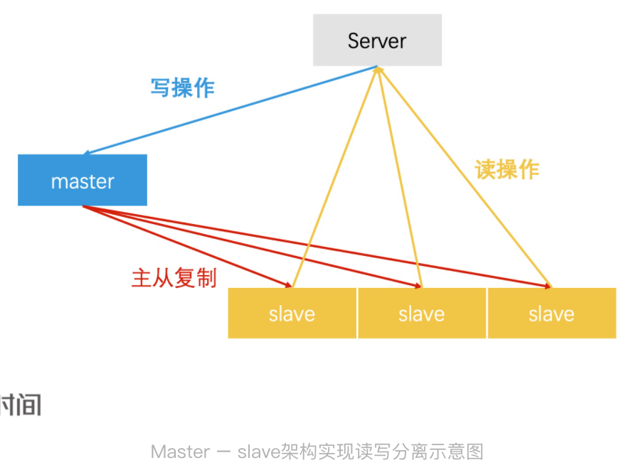
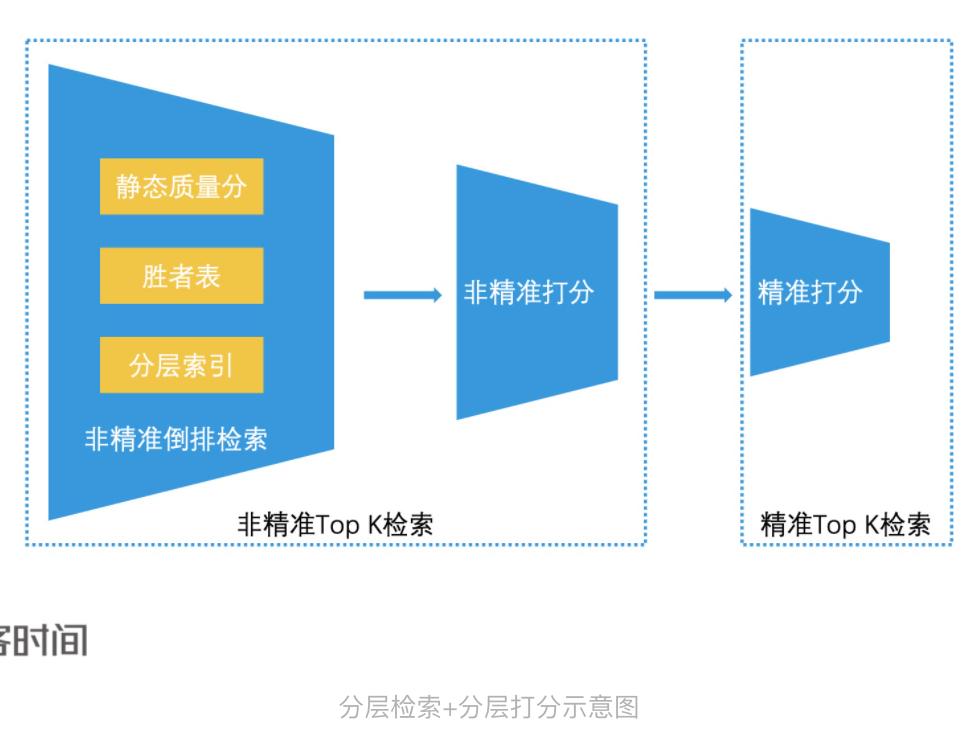
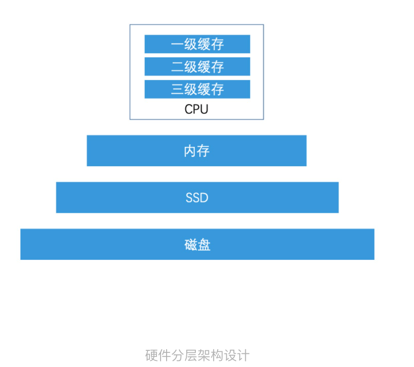

在进阶篇的讲解过程中，我们经常会提起一些设计思想，包括索引与数据分离、减少磁盘 IO、读写分离和分层处理等方案。这些设计思想看似很简单，但是应用非常广泛，在许多复杂的高性能系统中，我们都能看到类似的设计和实现。不过，前面我们并没有深入来讲，你可能理解得还不是很透彻。

所以，今天我会把专栏中出现过的相关案例进行汇总和对比，再结合相应的案例扩展，以及进一步的分析讨论，来帮助你更好地理解这些设计思想的本质。并且，我还会总结出一些可以参考的通用经验，让你能更好地设计和实现自己的高性能检索系统。

## 设计思想一：索引与数据分离

索引和数据分离是一种解耦的设计思想，能更好的聚焦在索引的优化

比如说，对于无法完全加载到内存中的数据，对它进行索引和数据分离后，我们就可以利用内存的高性能来加速索引的访问。第6讲线性索引的设计以及B+树中区分中间节点和叶子节点的设计，就都使用了索引和数据分离的设计思想。

那如果索引和数据都可以加载在内存中，我们还需要使用索引和数据分离吗？在这种情况下，将索引和数据分离，我们依然可以提高检索效率。以第5讲中查找唐诗的场景为例子。倒排索引中只会记录唐诗Id，不会记录每首唐诗的内容。这样做会有以下3个优点：

1. 节约存储空间，我们不需要再posting list重复记录唐诗内容

2. 减少检索过程中的复制代价。在倒排索引的检索过程中，我们需要将posting list中的元素进行多次比较和复制等操作。如果每个元素都存了大量且复杂的数据，而不是简单的id，那复制代价我们也不能忽略。

3. 保持索引的简单有效，让我们可以使用更多的优化手段加速检索过程。在加餐1中我们讲过，如果posting list都存着简单ID的话，我们可以将posting list转为位图来存储和检索。以及还可以使用roaring bitmap来提高检索效率。

   

索引和数据分类的设计理念可以让索引保持简洁和高效，来帮助我们聚焦在索引的优化技术上。从因此，保持索引的简洁高效是我们需要重点关注的。

当然，索引和数据分离也会增加一些弊端，如不一致性。怎么理解？我们可以考虑一个场景：数据已经修改或者删除，但是索引来不及更新，那么访问索引，得到的结果就是可能错误的。

对于不要求强一致性的应用场景，比如说在某些应用中更新用户头像时，我们可以接受一些临时性错误，只要能保证系统的最终已执行即可。但如果在要求强一致性的应用场景中，比如说金融系统中进行和金钱操作时就需要保证一致性管理，我们可以对索引和数据进行统一加锁处理，或者直接将索引和数据合并。这么说比较抽象，我们以mysql B+树为例，来看看怎么管理一致性。

Mysql中的B+树其实有两种，一种是MyISAM引擎，另一种是InnoDB引擎。它们的核心区别就在于，数据和索引是否是分离的。

在MyISAM引擎中，B+树的叶子节点仅存储了数据的位置指针，这是一种索引和数据分离的设计方案，叫做非聚簇索引。如果要保证MyISAM的数据已执行，那我们需要在表级别上进行加锁处理。

在InnoDB中，B+树叶子节点直接存储了具体数据，这是一种索引和数据一体的方案，叫做聚簇索引。

由于数据直接就存在索引的叶子节点中，因此InnoDB不需要给权标加锁来保证一致性，它只需要支持行级的锁就可以了。

## 设计思想二：减少磁盘IO

在大规模系统中，数据往往无法全部存储在内存中。因此，系统必然会涉及磁盘的读写操作。在这种应用场景下，**尽可能减少磁盘IO，往往是保证系统具有高性能的核心设计思想**

减少磁盘IO的一种常见设计，是将**频繁读取的数据加载到内存中**。前面讲到的索引和数据分离的方案，就使得我们可以优先将索引加载在内存中，从而提高系统检索效率。

当频繁读取的数据也就是索引太大，而无法装入内存的时候，我们不会简单地使用跳表或者哈希表加载索引，而会使用更加复杂的，具有压缩性质的前缀树这类数据结构和算法来压缩索引，让它能够放入到内存中。

尽管，单纯从数据结构和检索效率来看，前缀树的检索性能是低于跳表和哈希表，但是考虑到内存和磁盘在性能上巨大差异，那这种压缩索引的优势就很大了。

除了使用索引和数据分离，在高维空间中使用乘积量化对数据进行压缩和检索，以及使用分布式技术奖索引分片加载到不同的机器的内存中，也都可以减少磁盘的IO操作。

而**不可避免需要对磁盘进行读写，则应尽量避免随机读写**，我们可以使用预写日志技术以及利用磁盘的局部性原理，来顺序写大批量数据，从而提高磁盘访问效率。这是基于LSM树的HBASE和kafka，都是采用类似的设计。

你也许文，如果改用ssd来存储数据，那是不是不用关注磁盘IO的设计思想和技术？

一方面，虽然SSD的确快很多，但和内存比，依然会有1到2个数量级差距。甚至不同型号的SSD也会有差距的。

另一方面，SSD的批量顺序写依然比随机读写有更高的效率。对于SSD而言，它以页（page，4-16k）为读写单位，以块（block，256个page为一个block）为垃圾回收单位。由于SSD不支持原地更新的方式修改一个页，因此当我们写数据到页中时，ssd需要将原有的页标记为失败，并将原来的页数据和新写入的数据一起写入到新页中，那被标记为无效的页，会被垃圾回收机制处理，而垃圾回收又是一个很慢的操作过程。因此，随机写会造成大量的垃圾块，从而导致系统性能下降。所以，对于SSD而言，批量顺序写的性能依然会大幅度高于随机写。

总结来说，无论存储介质技术如何变化，将索引数据尽可能地全部存储在最快的介质中，始终是保证高性能检索的一个重要设计思路。此外，对于每种介质的读写性能，我们都需要进行了解，这样才能做合理的高性能设计。

## 设计思想三：读写分离

在高并发的场景下，如果系统需要对同一份数据同时进行读和写的操作，为了保证线程安全以及数据一致性，我们往往需要对数据操作加锁，但这回导致系统的性能降低。

而读写分离的设计方案，可以让所有的读操作只读一份数据，让所有的写操作作用在另一份数据上。这样就不存在读写竞争的场景，系统也就不需要加锁和切换了。在读操作频率高于写操作的应用场景中，使用读写分离的设计思想，可以大幅度提升系统的性能。很多我们熟悉的架构都采用这样的设计。

比如说，mysql的master-slave架构。在mysql的master-slave的架构设计中，master负责接收写请求。在数据写入master后，master会和多个slave同步，将数据同步更新到所有的slave中。所有的slave仅负责处理读请求。这样，mysql就可以完成读写分离了。

其实不仅仅是Mysql，redis中也存在类似的Master-Slave的读写分离设计。

除了mysql和redis，在倒排索引类的检索中，其实也存在类似的设计思路。比如说，第第9讲中我们讲过，对于索引更新这样的功能，我们往往会使用 Double Buffer 机制，以及全量索引 + 增量索引的机制来实现读写分离。通过这样的机制，我们才能保证搜索引擎、广告引擎、推荐引擎等系统能在高并发的应用场景下，依然具备实时的索引更新能力。

## 设计思想四：分层处理

在大规模检索系统中，不同数据的价值是不一样的，如果我们都使用同样的处理技术，其实会造成系统资源的浪费。因此，将数据分层处理也是非常基础且重要的一种设计。

最典型的例子，在第12讲中，我们提到的非精准Top K检索+精准Top K检索的设计思路了。简单回顾下，我们对所有的检索结果都进行好事复杂的精准打分，那会带来大量的资源浪费。所以，我们会进行初步筛选，快速选出可能比较好的结果，再进行精准筛选。这样的分层打分机制，其实非常像我们在招聘过程中，先进行简历筛选，再进行面试的处理流程。可见，这种设计思路有着非常广泛的使用场景。

包括我们前面提到的将索引放在内存中而不是磁盘上，这其实也是一种分层处理的思路。我们对索引进行分层，把最有价值的索引放在内存中，保证检索效率。而价值较低的大规模索引，则可以存在磁盘中。

如果你再仔细回想一下，这其实和第7讲中，LSM树将它认为最有价值的近期数据放在内存中，然后将其他数据放在磁盘上的思路是非常相似的。甚至是硬件设计也是这样，CPU中的一级缓存和二级缓存们也是基于同样的分层设计理念，将最有价值的数据，存在离CPU最近也是最贵的介质中。

还有一个典型的分层处理的设计实例就是，为了保证系统的稳定性，我们往往需要在系统负载过高时，启动自动降级机制。而好的自动降级机制，其实也是对流量进行分层处理，将系统认为有价值的流量保留没然后抛弃低价值流量。

总结来说，如果我们在应用场景中，对少数的数据进行处理，能带来大量的产出，那分层处理就是一种可行的设计思路。这其实二八原则：20%的资源带来80%的产出。

